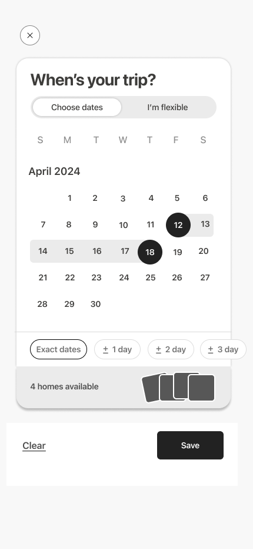
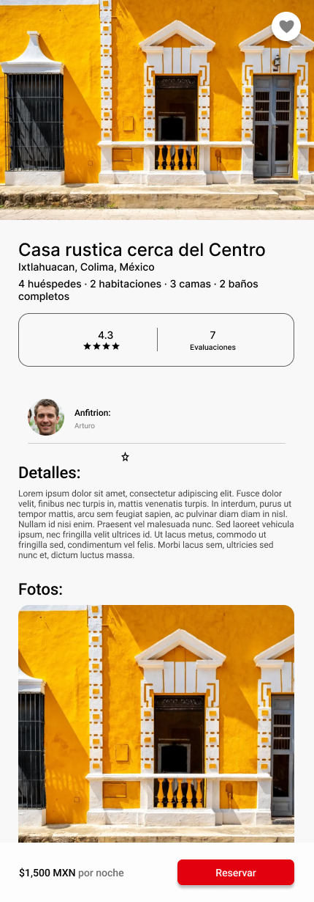
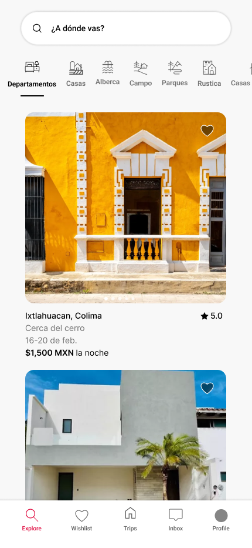
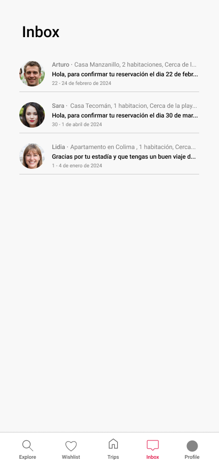
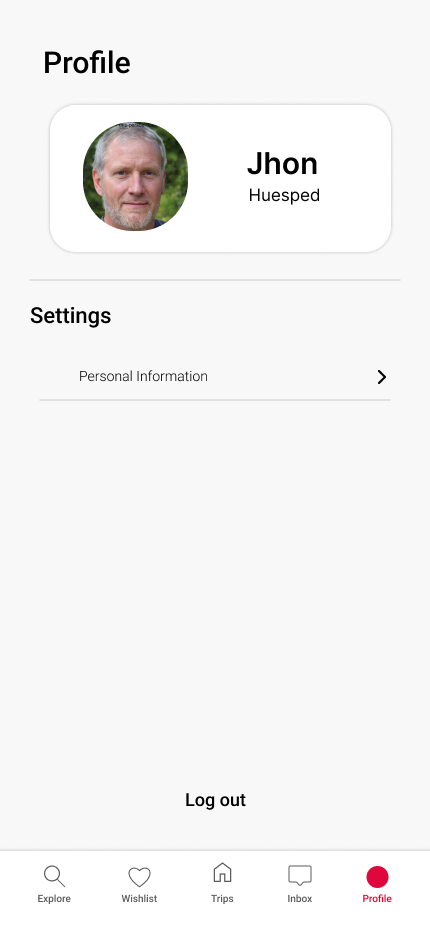
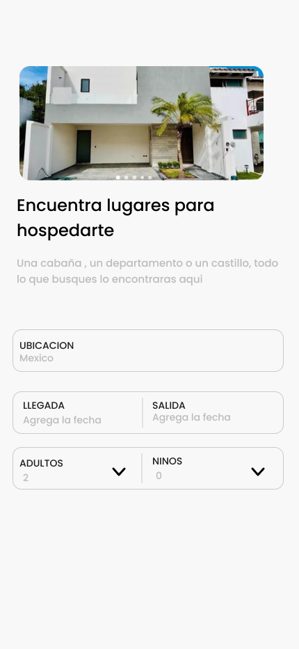
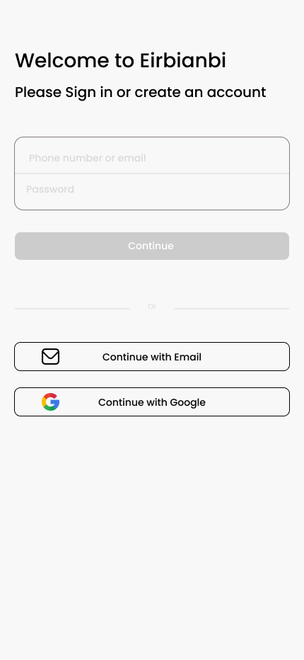
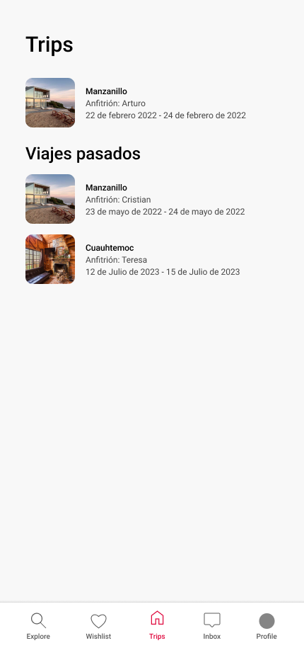
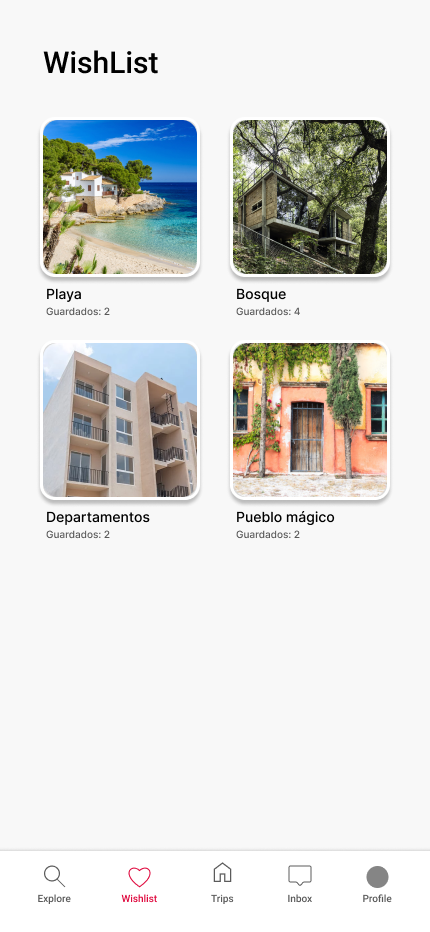

# Proyecto final

> [Ver instrucciones antes de iniciar](./instructions/instructions.md)

This README would normally document whatever steps are necessary to get the application up and running.

Things you may want to cover:

- Title or Project Name 
- Table of contents
- Description. A brief description of what the project is about
- How to Install and Run the Project.
- How to Use the Project.
- Credits
- Badges

Definir el producto que van a desarrollar:
Aplicación de Gestión de Propiedades y Arrendamientos.

Puede ser un producto completamente nuevo, una mejora de un producto existente, o la clonación de un producto.
Definir el alcance del MVP.

# Día 1: Definición y Descripción del Proyecto

## Alcance y caracteristicas:
Gestion de propiedades.
Base de datos.
Etiquetas para identificar.
Sistema de busqueda por ciudades.
Registro e inicio de sesion de usuarios.

## Identificación de usuarios y casos de uso.
Propietarios:
1. Crear y Administrar Propiedades: Los propietarios pueden agregar nuevas propiedades propocionando detalles como dirección, habitaciones, tamaño, etc.
2. Editar propiedades en renta.

Inquilinos
1. Buscar propiedades para rentar.
2. Gestionar propiedades rentadas.

## Documentación de la descripción del proyecto.
Crea una aplicación que facilite la gestión de propiedades y arrendamientos para propietarios e inquilinos. Centrada especialmete a turistas que busquen rentar alguna propiedad por un plazo definido. 

# Dia 2: Requerimientos Funcionales y No Funcionales

### Identificación y definición de los requerimientos funcionales del prototipo/MVP.
1. Registro y autenticación de Usuarios:
    - Los usuarios deben poder registrarse e iniciar sesion en la aplicacion.
    - Deben de existir 2 roles principales, los inquilinos y los propietarios.
    - El usuario comun solo se puede registrar como inquilino.
2. Gestion de Propiedades
    - Los propietarios pueden crear y editar sus propiedades en renta, agregando detalles como ubicacion, numero de habitaciones, numero de banos, precio, entre otros.
    - Los propietaros pueden eliminar de su registro las propiedades que ya no quieran rentar.
    - Los inquilinos pueden ver las propiedades en renta disponibles.
    - Los inquilinos pueden rentar alguna propiedad que este disponible.
    - Los inquilinos pueden ver las propiedades que tengan rentadas ademas de editar o cancelarlas.
3. Busqueda de Propiedades
    - Los inquilinos deben de poder buscar propiedades disponibles para alquilar, según la ubicación dada.
4. Interfaz de usuario intuitiva
    - La interfaz de usuario debe ser llamativa e intuitiva 
    - Debe de haber una navegacion entre las diferentes pantallas de la aplicacion.

### Identificación y definición de los requerimientos no funcionales del prototipo/MVP.

1. Usabilidad: La aplicación debe ser fácil de usar y comprender para propietarios, inquilinos y administradores, incluso para aquellos con poca experiencia en tecnología.

2. Rendimiento: La aplicación debe responder de manera rápida y eficiente, sin retrasos significativos en la carga de páginas o procesos. 

3. Seguridad: La aplicación debe garantizar la seguridad de la información confidencial de los usuarios, como datos personales y financieros.

4. Disponibilidad: Definición: La aplicación debe estar disponible y accesible para los usuarios en todo momento, con un tiempo de inactividad mínimo planificado.

5. Escalabilidad: La aplicación debe poder manejar un aumento en el número de usuarios y la cantidad de datos sin experimentar una degradación significativa del rendimiento. 

6. Fiabilidad: La aplicación debe ser confiable y no debe experimentar fallos inesperados o errores graves.

7. Compatibilidad: La aplicación debe ser compatible con una amplia gama de dispositivos móviles y sistemas operativos.

### Priorización de los requerimientos.

#### Must Have (Debe tener):
- Autenticación de Usuarios.
- Gestión de Propiedades.
- Gestión de Arrendamientos.
- Búsqueda de Propiedades.
- Solicitud de Arrendamientos.
- Gestión de Contratos de Arrendamiento.
- Pagos de Alquiler.
-Notificaciones y Recordatorios.
- Interfaz de Usuario.

#### Should Have (Debería tener):
- Seguridad.
- Usabilidad.
- Rendimiento.
- Disponibilidad.

#### Could Have (Podría tener):
- Escalabilidad.
- Fiabilidad.
- Compatibilidad.

#### Won't Have (No tendrá):
- Funcionalidades avanzadas no esenciales para el MVP.
- Mejoras de rendimiento o características adicionales que no son críticas para la funcionalidad básica de la aplicación.

### Diseño de Aplicación.

### Modelado de Base de Datos.

